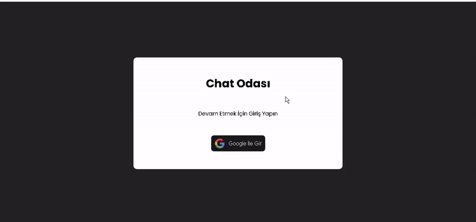

<h1>Chat_App</h1>

I've designed and coded a responsive Chat app, and it's ready to explore!

🔸 Project Name: [Chat app]

🔸 Technologies Used: React, Vite, Firebase

🔸 Project Description: This project, which I designed and coded from scratch, works flawlessly on various devices, from mobile phones to desktop computers. In this project, I integrated Firebase into an application I developed using the React library. I used Firebase Authentication to log in users, providing secure session management. I also created a chat application where users can communicate in different rooms. I provided real-time data synchronization using Firebase Firestore, thus providing instant messaging.

<h2>Screen_Shoot</h2>

